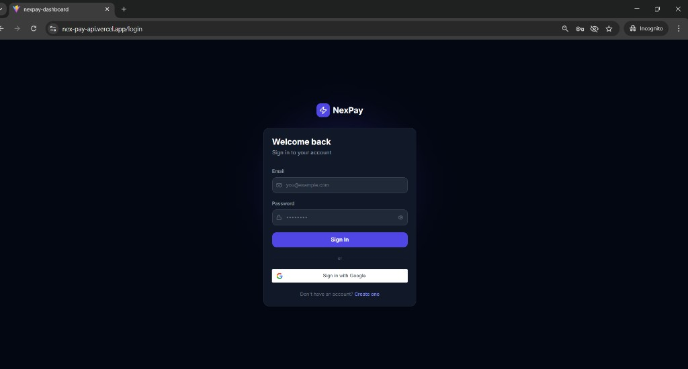
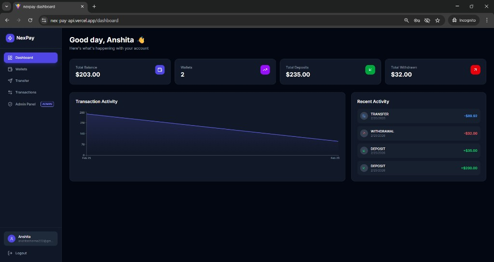
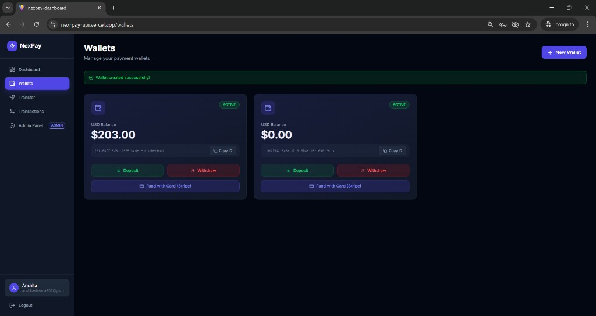
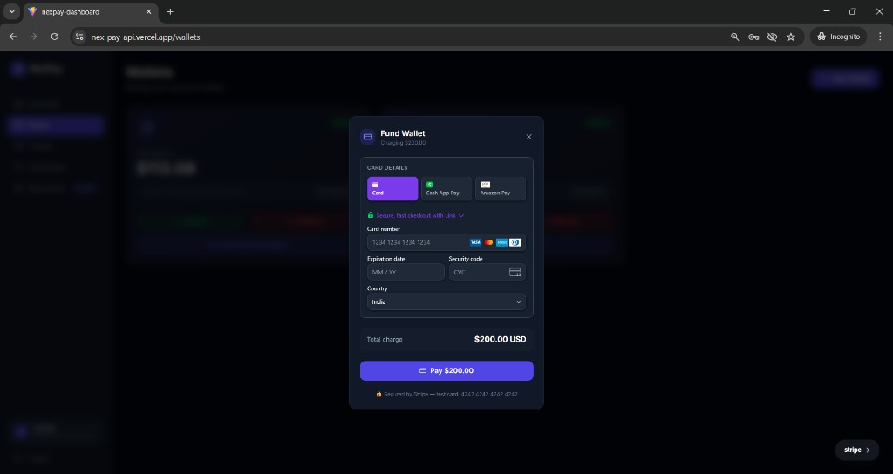
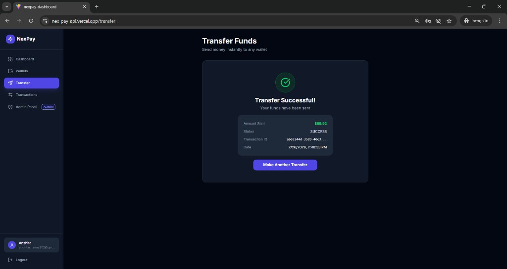
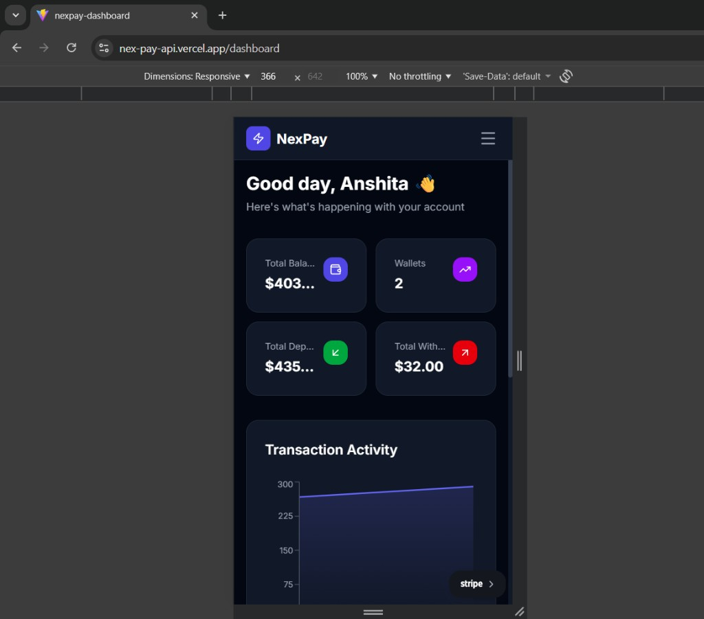

# NexPay — Digital Payment Platform

A full-stack digital payment platform with wallet management, peer-to-peer transfers, Stripe integration, and an admin dashboard. Built with **Spring Boot** (backend) and **React + TypeScript** (frontend).

**[Live Demo](https://nex-pay-api.vercel.app)** · **[API Docs (Swagger)](https://nexpay-5x7f.onrender.com/swagger-ui/index.html)**

---

## Screenshots

### Login


### Dashboard


### Wallets


### Fund Wallet via Stripe


### Transfer Funds


### Mobile Responsive


---

## Tech Stack

| Layer | Technology |
|---|---|
| Backend | Java 17, Spring Boot 3.x, Spring Security, JWT |
| Database | PostgreSQL (Supabase) |
| ORM | Spring Data JPA (Hibernate) |
| Payments | Stripe API |
| API Docs | Swagger / OpenAPI 3.0 |
| Frontend | React 18, TypeScript, Vite |
| Styling | Tailwind CSS v4, Framer Motion |
| State | Zustand, React Query |
| Auth | JWT + Google Sign-In (GSI) |
| Deployment | Render (backend), Vercel (frontend), Docker |

---

## Features

- **Authentication** — Email/password registration & login with JWT tokens, Google Sign-In via ID token flow
- **Wallet Management** — Create multiple wallets, deposit, withdraw with balance validation
- **Peer-to-Peer Transfers** — Send funds to any wallet with idempotency-safe transactions
- **Stripe Payments** — Add funds via credit/debit card using Stripe Payment Intents
- **Transaction History** — Paginated history with search/filter, refund support for transfers
- **Webhook System** — Register webhook URLs to receive real-time payment event notifications
- **Admin Panel** — View all users and transactions (role-based access control)
- **Mobile Responsive** — Fully responsive with hamburger menu sidebar toggle on mobile
- **Production Ready** — Dockerized, environment-based config with Spring profiles, deployed on Render + Vercel

---

## Architecture

```
React + TypeScript (Vercel)
        │
        │  REST API (HTTPS)
        ▼
Spring Boot (Render / Docker)
   ├── JWT Auth Filter
   ├── Controllers
   ├── Services
   └── Repositories (JPA)
        │
        ▼
   Supabase (PostgreSQL)
```

---

## API Endpoints

### Auth
| Method | Endpoint | Description |
|---|---|---|
| POST | `/api/v1/auth/register` | Register new user |
| POST | `/api/v1/auth/login` | Login (returns JWT) |
| POST | `/api/v1/auth/google` | Google Sign-In |

### Wallets
| Method | Endpoint | Description |
|---|---|---|
| POST | `/api/v1/wallets` | Create wallet |
| GET | `/api/v1/wallets` | Get user wallets |
| POST | `/api/v1/wallets/{id}/deposit` | Deposit funds |
| POST | `/api/v1/wallets/{id}/withdraw` | Withdraw funds |

### Payments
| Method | Endpoint | Description |
|---|---|---|
| POST | `/api/v1/payments/transfer` | Transfer funds |
| GET | `/api/v1/payments` | Transaction history (paginated) |
| GET | `/api/v1/payments/{id}` | Transaction detail |
| POST | `/api/v1/payments/{id}/refund` | Refund a transfer |

### Stripe
| Method | Endpoint | Description |
|---|---|---|
| POST | `/api/v1/stripe/create-payment-intent` | Create Stripe payment intent |
| POST | `/api/v1/stripe/confirm` | Confirm payment and credit wallet |

### Webhooks
| Method | Endpoint | Description |
|---|---|---|
| POST | `/api/v1/webhooks` | Register webhook |
| GET | `/api/v1/webhooks` | List webhooks |
| DELETE | `/api/v1/webhooks/{id}` | Delete webhook |

### Admin (ADMIN role only)
| Method | Endpoint | Description |
|---|---|---|
| GET | `/api/v1/admin/users` | All users (paginated) |
| GET | `/api/v1/admin/transactions` | All transactions (paginated) |

---

## Database Schema

```
users
├── id               UUID PRIMARY KEY
├── email            VARCHAR UNIQUE NOT NULL
├── password_hash    VARCHAR
├── full_name        VARCHAR
├── role             ENUM (USER, ADMIN)
├── created_at       TIMESTAMP
└── updated_at       TIMESTAMP

wallets
├── id               UUID PRIMARY KEY
├── user_id          UUID FK → users.id
├── balance          DECIMAL(15,2) DEFAULT 0.00
├── currency         VARCHAR(3) DEFAULT 'USD'
├── status           ENUM (ACTIVE, FROZEN)
└── created_at       TIMESTAMP

transactions
├── id                 UUID PRIMARY KEY
├── idempotency_key    VARCHAR UNIQUE NOT NULL
├── sender_wallet_id   UUID FK → wallets.id
├── receiver_wallet_id UUID FK → wallets.id
├── amount             DECIMAL(15,2)
├── type               ENUM (TRANSFER, DEPOSIT, WITHDRAWAL, REFUND)
├── status             ENUM (PENDING, SUCCESS, FAILED)
├── description        TEXT
└── created_at         TIMESTAMP

webhooks
├── id               UUID PRIMARY KEY
├── user_id          UUID FK → users.id
├── url              VARCHAR
├── event            VARCHAR
├── is_active        BOOLEAN
└── created_at       TIMESTAMP

stripe_payment_intents
├── id                  UUID PRIMARY KEY
├── wallet_id           UUID FK → wallets.id
├── stripe_intent_id    VARCHAR UNIQUE
├── amount              DECIMAL(15,2)
├── status              VARCHAR
├── created_at          TIMESTAMP
└── updated_at          TIMESTAMP
```

---

## Getting Started

### Prerequisites

- Java 17+
- Maven
- Node.js 18+
- PostgreSQL (or Supabase account)
- Stripe account (for payment features)

### Backend

```bash
cd nexpay-api

# Copy and configure environment
cp src/main/resources/application.yml.example src/main/resources/application.yml
# Edit application.yml with your DB credentials, JWT secret, Google Client ID, Stripe keys

# Run
mvn spring-boot:run
```

Backend starts at `http://localhost:8080`. Swagger UI at `http://localhost:8080/swagger-ui/index.html`.

### Frontend

```bash
cd nexpay-dashboard

# Install dependencies
npm install

# Copy and configure environment
cp .env.example .env
# Edit .env with your API URL and Google Client ID

# Run
npm run dev
```

Frontend starts at `http://localhost:5174`.

---

## Project Structure

```
NexPay-API-/
├── nexpay-api/                    # Spring Boot backend
│   ├── src/main/java/com/nexpay/api/
│   │   ├── config/                # Security, Swagger, Async config
│   │   ├── controller/            # REST controllers
│   │   ├── service/               # Business logic
│   │   ├── repository/            # JPA repositories
│   │   ├── model/                 # Entity classes
│   │   ├── dto/                   # Request/Response DTOs
│   │   ├── security/              # JWT filter, UserDetailsService
│   │   └── exception/             # Global exception handler
│   ├── Dockerfile
│   └── pom.xml
│
├── nexpay-dashboard/              # React + TypeScript frontend
│   ├── src/
│   │   ├── api/                   # Axios client & API modules
│   │   ├── components/            # Sidebar, Layout, Stripe modal
│   │   ├── pages/                 # Dashboard, Wallets, Transfer, etc.
│   │   ├── store/                 # Zustand auth store
│   │   └── types/                 # TypeScript interfaces
│   └── package.json
│
├── screenshots/                   # App screenshots
└── README.md
```

---

## Deployment

- **Backend**: Deployed on [Render](https://render.com) using Docker
- **Frontend**: Deployed on [Vercel](https://vercel.com) with SPA rewrites
- **Database**: Hosted on [Supabase](https://supabase.com) (PostgreSQL)

---

## License

This project is for educational and portfolio purposes.
